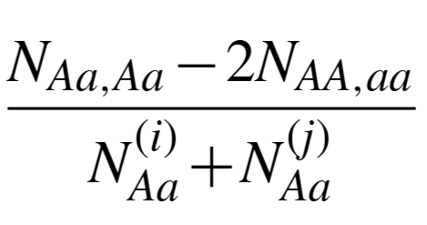
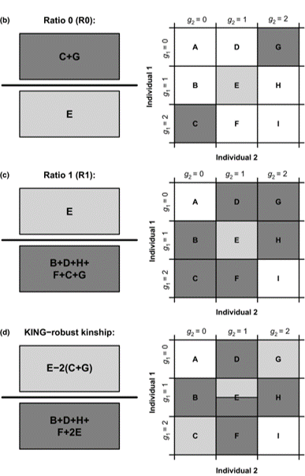
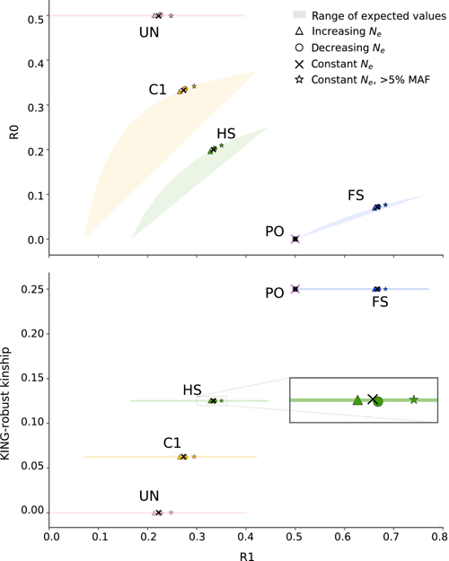

```{r setup, include=FALSE}
knitr::opts_chunk$set(echo = TRUE)
```

Don't care about the theory/background? Skip to the example: [Calculating relatedness]


To estimate relatedness, we consider whether or not alleles are Identical By Descent (IBD). IBD is simply asking if two alleles were inherited from a common ancestor. When we calculate relatedness, we're usually actually calculating kinship, the probability that two alleles sampled at random from two individuals are identical by descent. What this means, practically speaking, is that the highest kinship possible is 0.5. I'll explain below with an example using monozygotic twins. 

In the case of monozygotic twins, they are genetically identical. So while you might think kinship should be 1, it isn't. 

Imagine we have an AC heterozygote at some locus.

Individual 1: AC
Individual 2: AC

Remember that kinship is the probability that if we randomly sample one allele from Individual 1 and one from Individual 2, they are identical by descent. We could have the following possible samples:

1. Individual 1: A; Individual 2: A
2. Individual 1: A; Individual 2: C
3. Individual 1: C; Individual 2: C
4. Individual 1: C; Individual 2: A

Only when the same allele is sampled in both individuals do we satisfy IBD. So cases 1 and 3 are IBD, which is 0.5

We can do this same type of calculation for other relationships as well. But it is a little more complicated because we have to consider that each parent only passes on one of their two alleles.  Here are full siblings:

There are 4 possible inheritance patterns for full siblings:

- Pattern 1. Both get same allele from mom AND same allele from dad --> Share 2 alleles IBD
- Pattern 2. Both get same allele from mom, different alleles from dad --> Share 1 allele IBD
- Pattern 3. Different alleles from mom, both get same allele from dad --> Share 1 allele IBD
- Pattern 4. Different alleles from mom AND different alleles from dad --> Share 0 alleles IBD

We can calculate the probability of each pattern above: 

- Pattern 1: Share 2 alleles IBD = 0.25
- Pattern 2: Share 1 allele IBD = 0.25
- Pattern 3: Share 1 allele IBD = 0.25
- Pattern 4: Share 0 alleles IBD = 0.25

To get each of the probabilities above, you can think about it in the same way as the twin example. I'll just show Pattern 1 here where the parents are both AC heterozygotes. We get 2 alleles IBD when:

Scenario 1:

- Both siblings inherit A from parent 1: 0.5 × 0.5 = 0.25
- Both siblings inherit A from parent 2: 0.5 × 0.5 = 0.25
- Combined probability: 0.25 × 0.25 = 0.0625

OR

Scenario 2:

- Both siblings inherit A from parent 1: 0.5 × 0.5 = 0.25
- Both siblings inherit C from parent 2: 0.5 × 0.5 = 0.25
- Combined probability: 0.25 × 0.25 = 0.0625

OR

Scenario 3:

- Both siblings inherit C from parent 1: 0.5 × 0.5 = 0.25
- Both siblings inherit A from parent 2: 0.5 × 0.5 = 0.25
- Combined probability: 0.25 × 0.25 = 0.0625

OR

Scenario 4:

- Both siblings inherit C from parent 1: 0.5 × 0.5 = 0.25
- Both siblings inherit C from parent 2: 0.5 × 0.5 = 0.25
- Combined probability: 0.25 × 0.25 = 0.0625

Total probability of Pattern 1 (sharing 2 alleles IBD) = 0.0625 + 0.0625 + 0.0625 + 0.0625 = 0.25

Ok, so how do we get to the kinship for siblings? We can weight each scenario above by the probability that we would identify IBD. 

- Scenario 1: 1
- Scenario 2: 0.5
- Scenario 3: 0.5
- Scenario 4: 0

Then we multiply the probability of each scenario by the probability of detecting IBD:

```
(0.25 × 1.0) + (0.25 × 0.5) + (0.25 × 0.5) + (0.25 × 0.0)
Kinship = 0.25 + 0.125 + 0.125 + 0.0 = 0.25
```

But in practice you don't have to do this. Below are the expected kinship coefficients for common relationships:

| Relationship | Kinship |
|--------------|---------|
| Identical twins/clones/same individual | 0.5 |
| Sibling/Parent-Offspring | 0.25 |
| Half-sibling | 0.125 |
| First cousin | 0.0625 |
| Half-cousin | 0.031 |
| Second cousin | 0.016 |
| Half-second cousin | 0.008 |
| Third cousin | 0.004 |
| Unrelated | 0 |


## Identity by state vs. Identity by descent

[You can find a nice summary of the underlying math here, and this is where I pulled much of this material from](https://www.mv.helsinki.fi/home/mjxpirin/GWAS_course/material/GWAS5.html)

### Identity by state

The complication of these analyses is that we know that populations share alleles and we expect individuals to have the have the same allele at some loci even when the individuals are unrelated- this is called Identity By State (IBS).

In the most basic sense, we can calculate IBS by looking at the genotypes of each individual. The individuals can share 0, 1, or 2 alleles and we can assign these values to each locus. We then sum up these values and divide by 2*total loci to get the IBS estimate for any two individuals. For example:

| Individual 1 | Individual 2 | IBS Value |
|--------------|---------| ---------|
| AA | AT| 1|
| GC | GC| 2|
| TA | TT| 1|
| GG | AA| 0|
| AA | TT| 0|
| AC | AT| 1|
| CC | GC| 1|
| CC | TT| 0|
| AA | AT| 1|
| TT | AA| 0|

If we add these up, we get 7, and divide by 2*10 to get IBS = 0.35. 

Alternatively, if we calculate IBS as proportions of the total loci we can calculate IBS as `IBS2 + (0.5*IBS1)`. From our example above, `IBS2 = 0.1`, `IBS1= 0.5`, and we get: `0.1 + (0.5*0.5) = 0.35`.


### Identity by descent

The challenge here is to distinguish alleles that are shared due to descent (IBD; i.e., relatedness) from those that are simply the same by state. 

IBS will depend on population frequencies, where more common alleles will be shared more often than rare. If we know the allele frequencies of the population then we can generate predictions of IBS for any locus based on these frequencies. 

For example, if an allele has a frequency of 0.1 in the population, we expect two unrelated individuals to both carry this allele by chance with probability 0.1^2 = 0.01 (1% of the time). However, if we observe that related individuals share this rare allele much more frequently than 1% of the time, this excess sharing indicates IBD.

In practice, this is done in many different ways, but one common approach is using PLINK. Plink uses the observed IBS at each locus to calculate the probability of IBD.

The method relies on the fact that observed IBS can be explained by underlying IBD states. At any locus, the probability of observing k identical alleles between two individuals is:

`P(IBS=k) = P(IBS=k|IBD=0)×P(IBD=0) + P(IBS=k|IBD=1)×P(IBD=1) + P(IBS=k|IBD=2)×P(IBD=2)`

For each locus, the left-hand side values P(IBS=k) come from observed data - we count what proportion of loci show 0, 1, or 2 matching alleles across the genome.

The conditional probabilities P(IBS=k|IBD=z) are calculated using population allele frequencies. For example, if two individuals share 0 alleles IBD, all four of their alleles are sampled independently from the population, so we can calculate the probability they'll appear identical just by chance for one locus. We then take the average across all loci.

Because we know the observed IBS proportions and can calculate the conditional probabilities, we can solve these three equations (one for each k=0,1,2) for the three unknown IBD probabilities. These IBD probabilities are then combined into the kinship coefficient:
 
`0.5*P(IBD=1) + P(IBD=2)`
 
The key idea here is that we observe IBS directly from the data, calculate the conditional probabilities, then solve for the unobserved IBD states. See [table 2 in the plink paper](https://pmc.ncbi.nlm.nih.gov/articles/PMC1950838/) for the probabilities of genotypes given IBD states. For this to be accurate, we need to use many loci across the genome.


**With this basic approach, we are assuming there is no population structure**

## What about population structure?

When there is population structure, the PLINK method described above will be biased and unreliable because it assumes individuals are drawn from a homogeneous population with known allele frequencies. Fortunately, there have been additional methods developed that work well under these conditions. The most well known is the [KING-Robust approach](https://www.kingrelatedness.com/manual.shtml) (link to [original paper](https://www.chen.kingrelatedness.com/publications/pdf/BI26_2867.pdf)). 


{width=20%}

Relatedness is estimated by subtracting the count of loci where individuals are opposite homozygotes from the count of loci where both are heterozygous, then dividing by the sum of all heterozygous loci observed in either individual.

This approach is robust to population structure because it doesn't require knowing population allele frequencies. However, it still requires that loci are in Hardy-Weinberg equilibrium.

from the manual: 

    Close relatives can be inferred fairly reliably based on the estimated kinship coefficients as shown in the following simple algorithm: an estimated kinship coefficient range >0.354, [0.177, 0.354], [0.0884, 0.177] and [0.0442, 0.0884] corresponds to duplicate/MZ twin, 1st-degree, 2nd-degree, and 3rd-degree relationships respectively. Relationship inference for more distant relationships is more challenging


## Calculating relatedness

Ok, so how do we actually analyze data? We're going to follow the approach described by [Waples et al.](https://doi.org/10.1111/mec.14954) using [NgsRelat](https://github.com/ANGSD/NgsRelate).

This method is nice because:

1. It doesn't require allele frequencies
2. Can work with low coverage data where genotypes don't have to be hard called.

With the approach, we use three estimators to identify relatedness: KING-robust kinship estimator, R0, and R1. These are defined as follows, where we're looking at the genotype for each of two individuals:

{width=40%}

R0 is the proportion of sites where individuals have unique homozygous genotypes, scaled by the shared heterozygotes. This is a modified proportion of loci where IBS is 0, and is robust to ascertainment bias. 

Specifically, we're interested in the relationship between [R1, R0] and [R1, KING-robust kinship]. The rationale here is that each of the estimators, and the two relationships, are quantifying a unique aspect of relatedness and, are non-overlapping in their expectations for close familial relationships. So we can use the distributions from both relationships to robustly infer relatedness. 


{width=60%}

For example, the KING estimator cannot distinguish parent-offspring from full sibs. However, R0 and R1 can. This is because R0 is looking at the number of unique homozygotes for each individual and a parent offspring pair must always share one allele; R0 will be ~0 for parent-offspring and > 0 for full sibs. Similarly, R1 will be higher for full sibs than parent offspring.   

### ngsrelate

We will use [NgsRelat](https://github.com/ANGSD/NgsRelate) to calculate R0, R1, and the KING estimator. See the [NgsRelate paper here](https://academic.oup.com/gigascience/article/8/5/giz034/5481763).

This program can calculate a ton of different relatedness estimators and can handle genotype likelihoods or a vcf, which means it can handle low coverage data. For our example, we will use a vcf. 


```{bash include = FALSE, eval =F}

ngsrelate -h  whales.vcf.gz -T GT -c 1 -O relatedness.res


```

Note that `-T GT` says we're using genotypes and `-c 1` means we've already called these genotypes. 

```{r include = T}
library(ggplot2)
#library(tidyverse)
#library(scales)
#library(ggbeeswarm)

dat <- read.table("relatedness.res", header=T)

ggplot(dat, aes(x=R1, y=KING)) +
  geom_point(alpha=0.5, size=2) 

ggplot(dat, aes(x=R1, y=R0)) +
  geom_point(alpha=0.5, size=2)
  
  
```

You'll notice that we have a bunch of negative values for our KING estimator and values > 0.5 for R0. This means that these individuals are less related than expected (i.e., maybe population structure is present). For our purposes, we don't care about these unrelated individuals and can focus only on individuals with R0 < 0.5 and KING > 0. 

```{r include = T}

library(tidyverse)

# Filter for related individuals: R0 < 0.5 and KING > 0
filter_dat <- dat %>%
  filter(R0 < 0.5, KING > 0)

```

and lets color these by the range KING gives for each relationship:

      Close relatives can be inferred fairly reliably based on the estimated kinship coefficients as shown in the following simple algorithm: an estimated kinship coefficient range >0.354, [0.177, 0.354], [0.0884, 0.177] and [0.0442, 0.0884] corresponds to duplicate/MZ twin, 1st-degree, 2nd-degree, and 3rd-degree relationships respectively. Relationship inference for more distant relationships is more challenging
      
So we will consider anything beyond a 3rd degree relative (cousin) unrelated. 


```{r include = T}

dat <- dat %>%
  mutate(relationship = case_when(
    KING > 0.354 ~ "Duplicate/MZ twin",
    KING >= 0.177 & KING <= 0.354 ~ "Full-sib/Parent-Offspring",
    KING >= 0.0884 & KING < 0.177 ~ "Half-sibling", 
    KING >= 0.0442 & KING < 0.0884 ~ "Cousins",
    KING < 0.0442 ~ "Unrelated",
    TRUE ~ "Other"
  ))

# then drop the points we don't want:
filter_dat <- dat %>%
  filter(R0 < 0.5, KING > 0)

ggplot(filter_dat, aes(x = R1, y = KING, color = relationship)) +
  geom_point(size = 2) +
  ylim(0, 0.25) +
  labs(color = "Relationship")

# Plot R1 vs R0 with relationship colors  
ggplot(filter_dat, aes(x = R1, y = R0, color = relationship)) +
  geom_point(size = 2) +
  ylim(0, 0.5) +
  labs(color = "Relationship")

```

But what about the Full-sibs/parent-offspring? Remember that we can use R0 to tell these apart. We expect parent-offspring pairs to be ~0 and full-sibs to be > 0. 

Because we're elevated above 0, these individuals are probably siblings, rather than parent offspring. 

```{r include = T}

table(dat$relationship)

```


